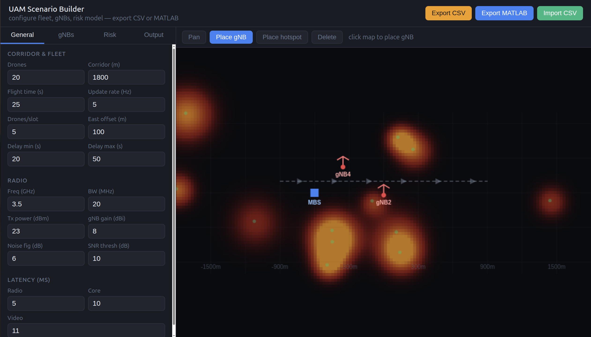
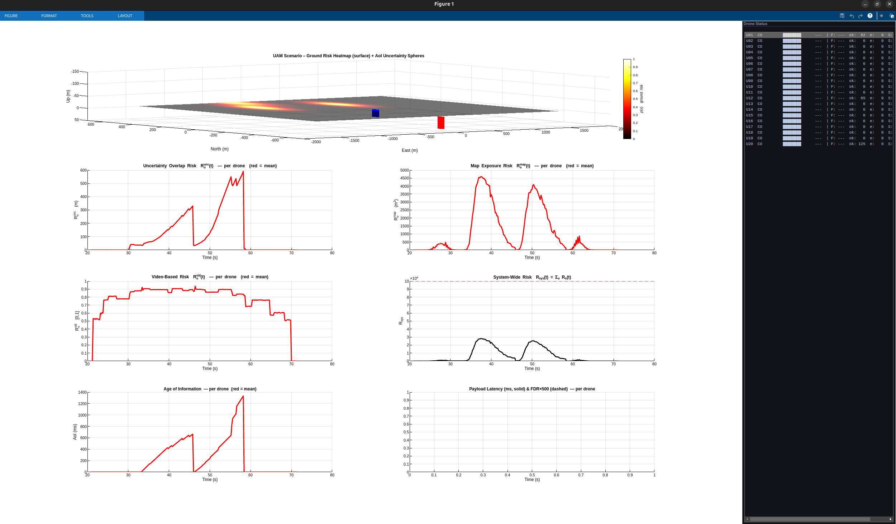

# UAM-AoI-Risk-Sim

**Urban Air Mobility — Age of Information & Risk-Aware Scheduling Simulator**

A MATLAB simulation framework for evaluating multi-drone UAM corridor operations under configurable scheduling policies, incorporating real-time risk assessment, Age of Information (AoI) metrics, 5G NR link modelling, and risk-aware trajectory planning via A*.

---

## Overview

This project simulates a UAM (Urban Air Mobility) corridor where a fleet of autonomous drones transmits telemetry and video data to a ground control station via a 5G NR radio access network. The simulator evaluates scheduling policies and tracks per-drone and system-wide metrics including AoI, payload latency, risk exposure, and channel quality.

The framework is designed for research into **information-freshness-aware** and **risk-aware** radio resource management for drone fleets.

---

## Repository Structure

```
.
├── uam-sim-new/                        ← Modular simulator (main entry point)
│   ├── run_sim.m                       ← Entry point (replaces monolith)
│   ├── setup_paths.m                   ← Adds subdirectories to MATLAB path
│   ├── compare_policies.m              ← Side-by-side policy comparison
│   ├── run_sweep.m / sweep_paper.m     ← Parameter sweep scripts
│   ├── urban_linear_sim.m              ← Urban linear corridor scenario
│   ├── urban_circuit_sim.m             ← Urban circuit scenario
│   │
│   ├── config/
│   │   └── validate_uam_config.m       ← Config validation & defaults
│   │
│   ├── core/
│   │   ├── init_scenario.m             ← Scene, BS, drone setup
│   │   ├── init_state.m                ← Comm, payload, risk buffers
│   │   ├── init_ground_risk.m          ← Ground population heatmap
│   │   ├── astar_grid.m                ← A* on 8-connected grid (distance+risk)
│   │   ├── compute_risk_map.m          ← Normalised risk map for A*
│   │   ├── route_risk_astar.m          ← Per-drone Risk-A* trajectory planner
│   │   ├── resample_path_to_slots.m    ← Waypoint → per-slot positions
│   │   ├── step_read_positions.m       ← Read positions / mark landed drones
│   │   ├── step_traffic.m              ← AVIATOR packet generation
│   │   ├── step_channel.m              ← 5G NR channel model
│   │   ├── step_transmit.m             ← TX decision, payload/FDR, AoI update
│   │   ├── step_risk.m                 ← R_unc + R_map + R_vid + R_sys
│   │   └── schedule_sources.m          ← Dispatcher to policies/
│   │
│   ├── policies/
│   │   ├── policy_round_robin.m
│   │   ├── policy_round_robin_aware.m
│   │   ├── policy_pf_classic.m
│   │   ├── policy_aoi_pure.m
│   │   ├── policy_risk_aware.m
│   │   └── policy_max_weight_doc.m
│   │
│   ├── viz/
│   │   ├── init_dashboard.m            ← Figure layout, tiles, panels
│   │   └── update_dashboard.m          ← Live per-slot figure update
│   │
│   ├── util/
│   │   ├── build_scenario_config.m     ← Default scenario configuration
│   │   ├── collect_results.m           ← Package state → results struct
│   │   ├── export_csv.m                ← CSV export of per-drone series
│   │   ├── generate_arrival_times.m    ← Arrival model implementations
│   │   ├── drone_status_line.m         ← Drone status panel formatter
│   │   ├── compute_lower_bound.m       ← Theoretical lower bound
│   │   └── compute_lower_bound_doc.m
│   │
│   └── tests/
│       └── test_routing.m              ← Unit + integration tests for Risk-A*
│
├── uam_scenario_builder.html           ← Web-based scenario builder (standalone)
├── Dash/                               ← R Markdown dashboard for results analysis
│   ├── uam_dashboard.Rmd
│   └── styles.css
├── build_scenario_config.m             ← Legacy root-level config (kept for compat)
└── UAM_AoI_Control_Sim_WithRisk_load_scnarios.m   ← Original monolith (legacy)
```

---

## Features

- **6 Scheduling Policies**
  - `round-robin` — baseline equal-time allocation
  - `round-robin-aware` — round robin with risk awareness
  - `pf-classic` — classic Proportional Fair (throughput-maximising)
  - `aoi-pure` — pure Age of Information priority
  - `risk-aware` — prioritises drones with highest combined risk × AoI
  - `max-weight-doc` — max-weight policy with DoC (Degree of Criticality)

- **Risk-Aware Trajectory Planning (Risk-A*)**
  - A* on an 8-connected grid with mixed distance + ground-risk cost
  - Ground risk map built from configurable population density hotspots
  - Tunable weights `w_d` (distance) and `w_r` (risk); must sum to 1
  - Trajectories pre-computed per drone before simulation starts
  - Falls back to static (straight-line) mode when `routing.mode = 'static'`

- **3-Component Risk Model**
  - `R_unc` — uncertainty overlap risk (position/navigation uncertainty)
  - `R_map` — map exposure risk (ground population heatmap)
  - `R_vid` — video quality degradation risk

- **5G NR Radio Model**
  - Path loss from configurable carrier frequency (default 3.5 GHz)
  - Thermal noise floor, noise figure, configurable bandwidth
  - SNR-threshold link success/failure
  - Multi-cell micro-BS + master gNB topology

- **Flexible Arrival Models**
  - `deterministic` — uniform spacing
  - `poisson` — homogeneous Poisson process
  - `nhpp` — non-homogeneous PP with Gaussian peak
  - `rush_hour` — double-peak rush-hour profile
  - `batch` — batch Poisson arrivals

- **Web Scenario Builder** (`uam_scenario_builder.html`)
  - Browser-based GUI to configure all simulation parameters visually
  - **Import .m** — load an existing `build_scenario_config.m`, edit fields, re-export
  - Exports `build_scenario_config.m` ready to run

- **Metrics & Export**
  - Per-drone AoI (ms), payload latency, FDR (<500 ms)
  - Per-drone risk components over time
  - System-wide aggregated risk `R_sys(t)`
  - Optional CSV export of all per-slot series
  - R Markdown dashboard (`Dash/`) for post-simulation analysis

---

## Quick Start

### Requirements
- MATLAB R2025b or later
- UAV Toolbox (for `uavScenario`)

### Run with default config
```matlab
cd uam-sim-new
setup_paths()
run_sim()
```

### Run with parameter overrides
```matlab
cd uam-sim-new
setup_paths()
cfg = build_scenario_config();
cfg.numDrones        = 10;
cfg.schedulingPolicy = 'risk-aware';
cfg.w_unc            = 0.5;
run_sim(cfg);
```

### Enable Risk-A* routing
```matlab
cfg = build_scenario_config();
cfg.routing.mode  = 'risk_astar';
cfg.routing.w_d   = 0.3;   % distance weight
cfg.routing.w_r   = 0.7;   % risk weight
run_sim(cfg);
```

### Run test suite
```matlab
cd uam-sim-new
setup_paths()
run('tests/test_routing.m')
```

### Use the Web Scenario Builder
Open `uam_scenario_builder.html` in any modern browser. Configure the scenario visually and click **Export Config** to generate a `build_scenario_config.m` file. Use **Import .m** to load and edit an existing config.

<p align="center">
  
</p>
<p align="center"><em>Figure 0 — UAM Web Scenario Builder</em></p>

---

## Configuration Parameters

| Parameter | Default | Description |
|---|---|---|
| `schedulingPolicy` | `'pf-classic'` | Scheduling algorithm |
| `sched_alpha` | `0.5` | Hybrid policy weight (α) |
| `numDrones` | `5` | Number of drones in corridor |
| `corridorLength` | `30000 m` | Corridor length |
| `flightTime` | `2000 s` | Transit time (sets speed) |
| `updateRate` | `15 Hz` | Simulation update rate |
| `dronesPerSlot` | `1` | Max simultaneous transmitters |
| `fc` | `3.5 GHz` | Carrier frequency |
| `bw` | `20 MHz` | Channel bandwidth |
| `thresholdSNR` | `10 dB` | Minimum decodable SNR |
| `w_unc / w_map / w_vid` | `0.4 / 0.4 / 0.2` | Risk component weights (must sum to 1) |
| `d_crit` | `150 m` | Critical separation distance |
| `tau_max` | `500 ms` | Maximum tolerable AoI |
| `numHotspots` | `12` | Random ground risk hotspots |
| `rng_seed` | `42` | Reproducibility seed |
| `routing.mode` | `'static'` | Trajectory mode: `'static'` or `'risk_astar'` |
| `routing.w_d` | `0.5` | A* distance weight |
| `routing.w_r` | `0.5` | A* risk weight |
| `arrivalModel` | `'deterministic'` | Drone arrival process |
| `csvExport` | `false` | Enable CSV export of per-slot series |

See `uam-sim-new/config/validate_uam_config.m` for the full parameter list and defaults.

---

## Outputs

The simulator produces a live 7-panel MATLAB dashboard:

<p align="center">
  
</p>
<p align="center"><em>Figure 1 — UAM scenario: ground risk heatmap + per-drone metric panels</em></p>

1. **3D Ground Risk Heatmap** with drone trajectories and AoI uncertainty spheres
2. **Uncertainty Overlap Risk** `R_unc(t)` per drone
3. **Map Exposure Risk** `R_map(t)` per drone
4. **Video-Based Risk** `R_vid(t)` per drone
5. **System-Wide Risk** `R_sys(t)` with threshold line
6. **Age of Information** (ms) per drone
7. **Payload Latency** (ms) & FDR×500 per drone

A live **Drone Status panel** shows per-drone state (position, AoI, SNR, risk) during execution.

---

## Scheduling Policy Details

### `pf-classic`
Maximises long-run fairness by scheduling the drone with the best instantaneous-to-average throughput ratio:
```
score_u = R_inst(u) / T_avg(u)
```

### `risk-aware`
Prioritises safety-critical updates; score combines risk and AoI:
```
score_u = R_u(t) × h_u(t)
R_u = w_unc·R_unc + w_map·R_map + w_vid·R_vid
```

### `max-weight-doc`
Max-weight scheduler weighted by Degree of Criticality (DoC):
```
score_u = DoC_u(t) × h_u(t)
```

---

## Adding a New Scheduling Policy

1. Create `uam-sim-new/policies/policy_myname.m` with signature:
   ```matlab
   function txSlots = policy_myname(activeDrones, K, state, cfg)
   ```
2. Add a `case 'myname'` entry in `uam-sim-new/core/schedule_sources.m`
3. Set `cfg.schedulingPolicy = 'myname'` to use it

---

## License

This project is released for research and academic use. See `LICENSE` for details.

---

## Citation

If you use this simulator in your research, please cite:

```
@misc{uam_aoi_risk_sim,
  title  = {UAM AoI Risk-Aware Scheduling Simulator},
  year   = {2026},
  url    = {https://github.com/andremelow/UAM-AoI-Risk-Sim}
}
```
